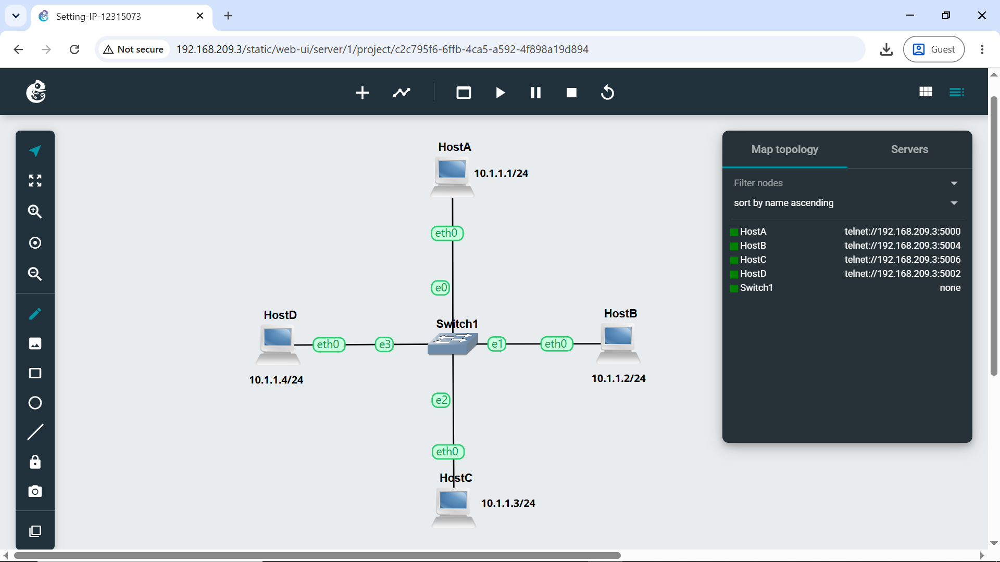
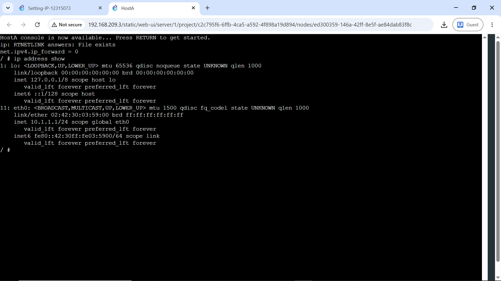
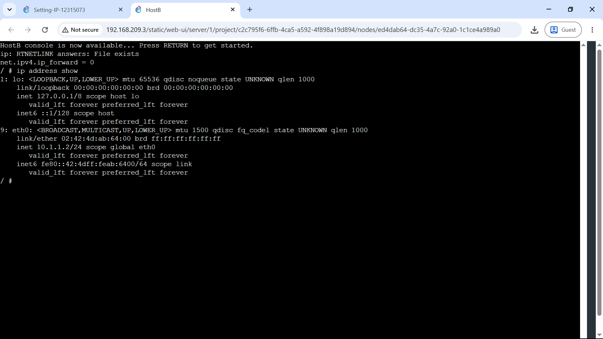
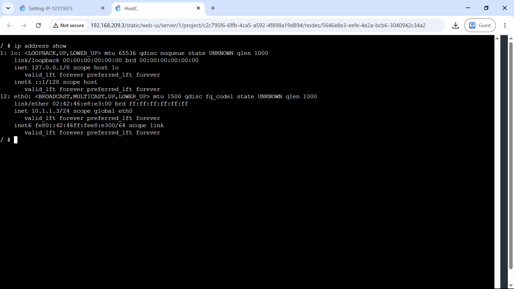
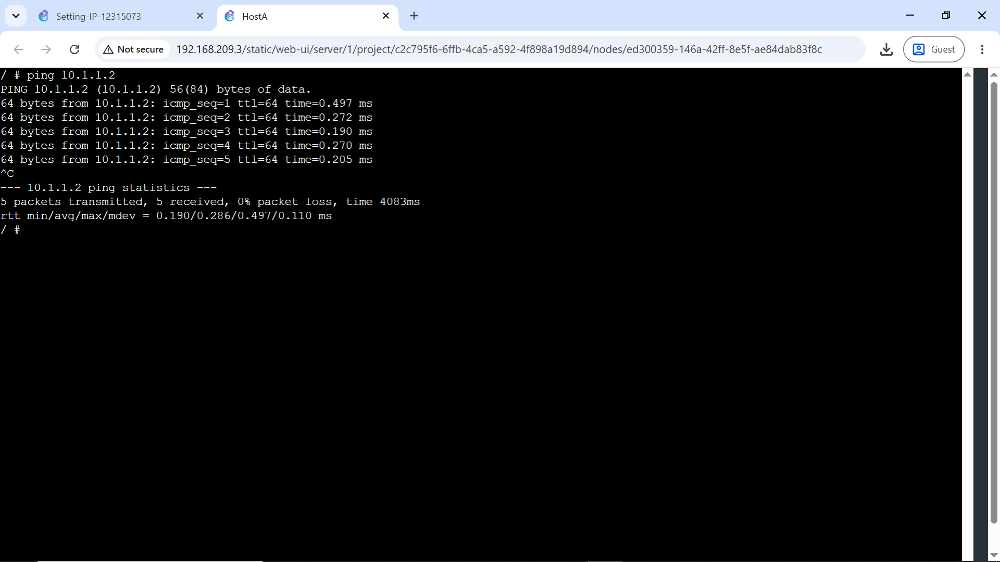
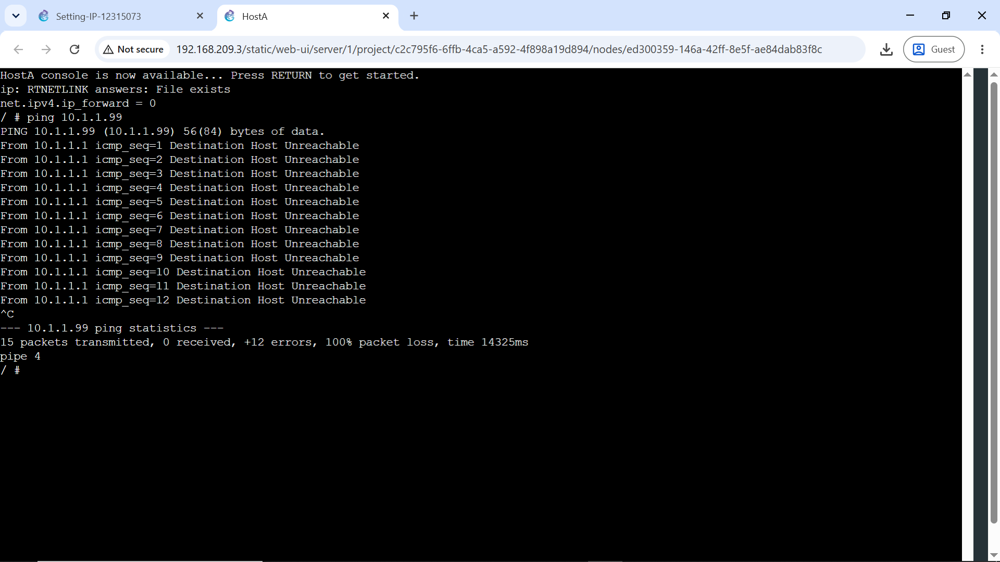
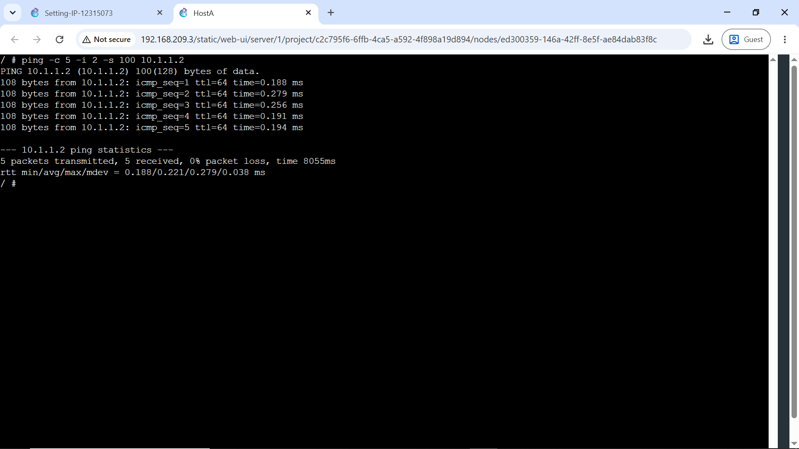

# Week 02 | Trasport Layer Protocol

## Work Completed
I created a four-host LAN on `10.1.1.0/24` through one Ethernet switch.

| Host | Address | Configuration method |
|---|---|---|
| HostA | `10.1.1.1/24` | GNS3 Configure |
| HostB | `10.1.1.2/24` | GNS3 Configure |
| HostC | `10.1.1.3/24` | Edited `/etc/network/interfaces` |
| HostD | `10.1.1.4/24` | `ip address add` |








## Testing Results
A normal ping from HostA to HostB returned **5/5 replies, 0% packet loss**, with an average RTT of about **0.286 ms**.



A ping to unused address `10.1.1.99` produced **100% packet loss** after more than 10 seconds.



I also tested count, interval and payload size using:

```bash
ping -c 5 -i 2 -s 100 10.1.1.2
```



[Project file](Setting-IP-12315073.gns3project)

## Key Learning and Reflection
The three configuration methods showed an important difference between persistent and temporary addressing. `/etc/network/interfaces` survives a restart, while `ip address add` applies immediately but is temporary. Ping also showed that successful reachability, delay and packet loss provide different information about network behaviour.
