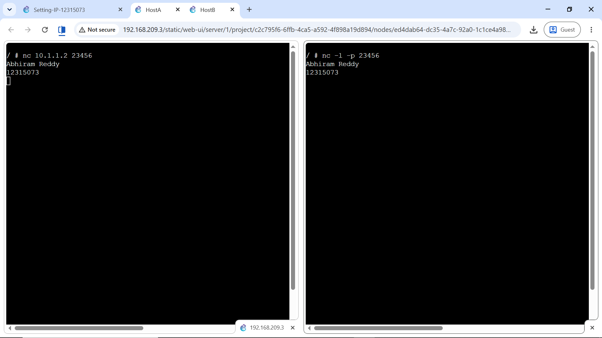

# Week 03 | Transmission Control Protocol

## Work Completed
I reused the Week 2 LAN and tested application-layer communication with Netcat. HostB listened on TCP port `23456` and HostA connected to `10.1.1.2:23456`.

```bash
# HostB
nc -l -p 23456

# HostA
nc 10.1.1.2 23456
```

The client sent my name and the server returned my student ID.



## Packet Capture and Testing
I captured traffic on the HostA-to-switch link while generating ping and Netcat traffic.

[Packet capture](Capture-Basics-12315073-ping-netcat.pcap)

## Key Learning and Reflection
Ping and Netcat test different layers. Ping uses ICMP to confirm IP reachability, while Netcat verifies that an application can communicate using TCP or UDP. Packet capture adds another level of verification because it records the actual frames and packets crossing a link, which can later be inspected in Wireshark.

