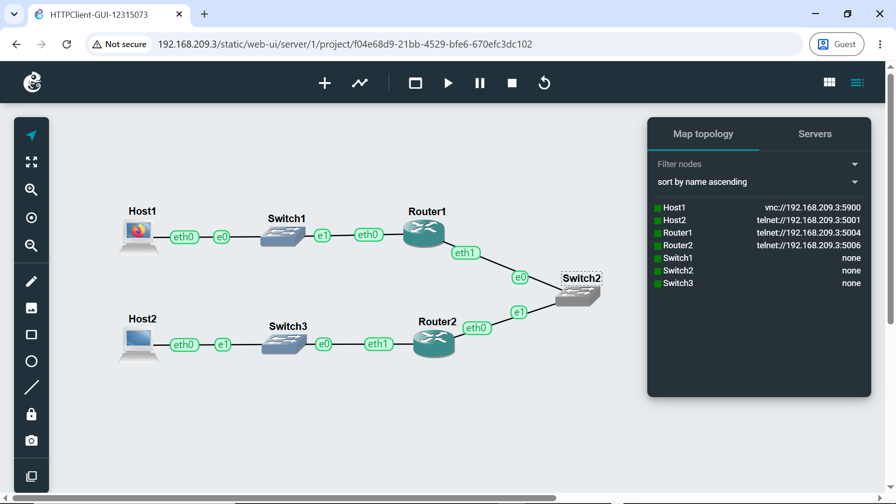
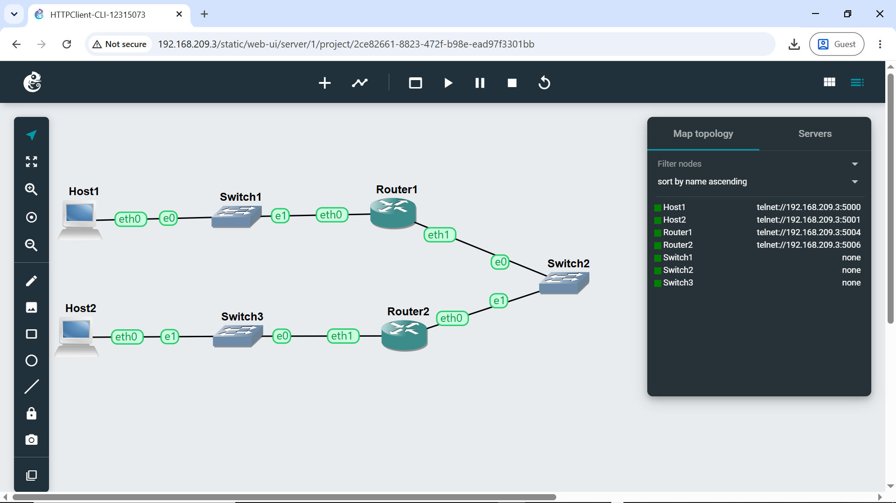
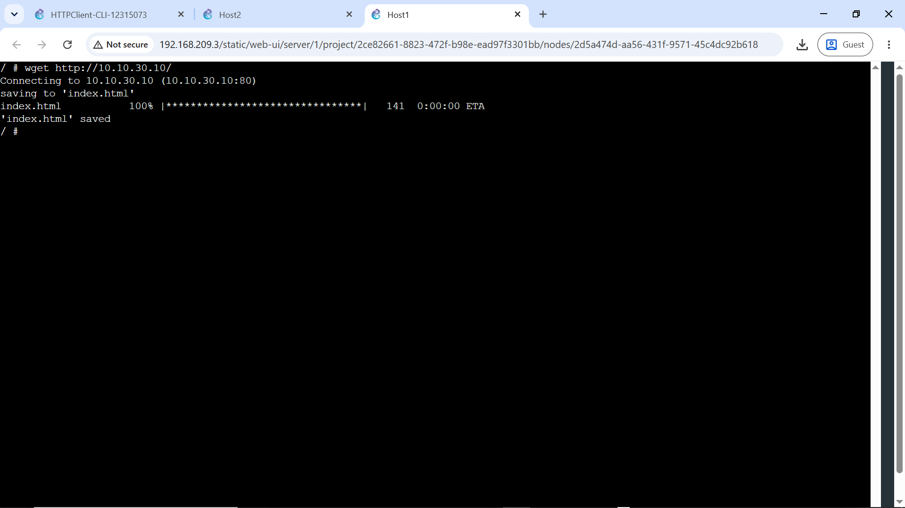
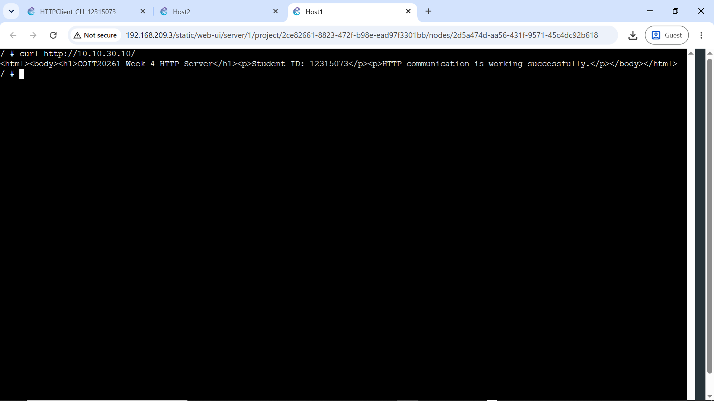

# Week 04 | Classful & classless Addressing

## Task 1 – HTTP Client with GUI
I created three routed subnets with a Firefox client on Subnet A and an HTTP server on Subnet C. Router1 and Router2 forwarded traffic through Subnet B.



Firefox on Host1 accessed:

```text
http://10.10.30.10/
```

A packet capture taken in Subnet B recorded the TCP connection, `GET / HTTP/1.1` request and `HTTP/1.0 200 OK` response.

[GUI packet capture](HTTPClient-GUI-12315073-subnetB.pcap)  
[GUI project](HTTPClient-GUI-12315073.gns3project)

## Task 2 – HTTP Client with CLI
I copied the GUI project, replaced Firefox Host1 with a Linux host using the same address, and tested the web server using `wget` and `curl`.

```bash
wget http://10.10.30.10/
curl http://10.10.30.10/
```

`wget` successfully saved `index.html`, while `curl` displayed the returned HTML directly.







[CLI packet capture](HTTPClient-CLI-12315073-subnetB.pcap)  
[CLI project](HTTPClient-CLI-12315073.gns3project)

## Key Learning and Reflection
This week demonstrated that HTTP works independently of the user interface used by the client. Firefox, `wget` and `curl` all generated HTTP traffic, but command-line clients are lighter and easier to automate. Capturing traffic on the transit subnet also showed that application data must be routed successfully through both routers before the remote server can respond.
