# COIT20261 – Week 5 Portfolio

**Student ID:** 12315073

## Task 1 – Routing Tables
I created two subnets connected by one Linux router.

- Host1: `10.1.1.11/24`, gateway `10.1.1.1`
- Host2: `10.1.1.12/24`, gateway `10.1.1.1`
- Router1: `10.1.1.1/24` and `10.1.2.1/24`
- Host3: `10.1.2.2/24`, gateway `10.1.2.1`

Forwarding was disabled on the hosts and enabled on Router1. `ip route show` confirmed default routes on the hosts and directly connected routes on the router.

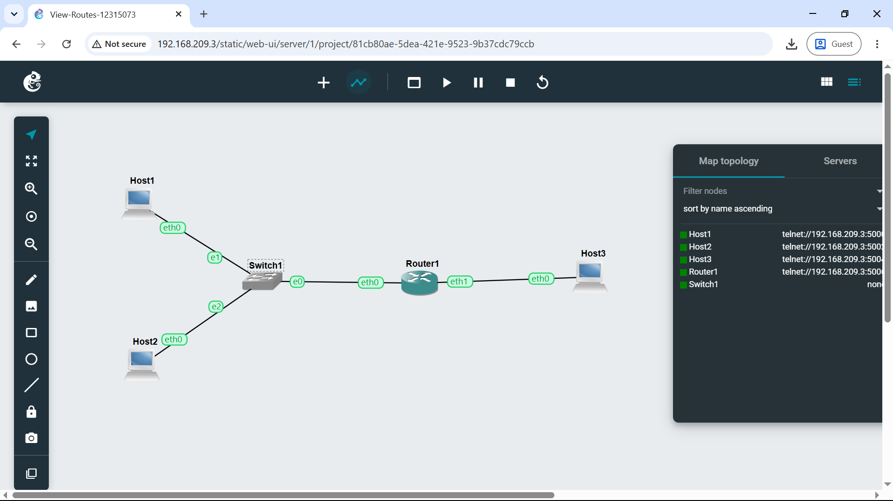

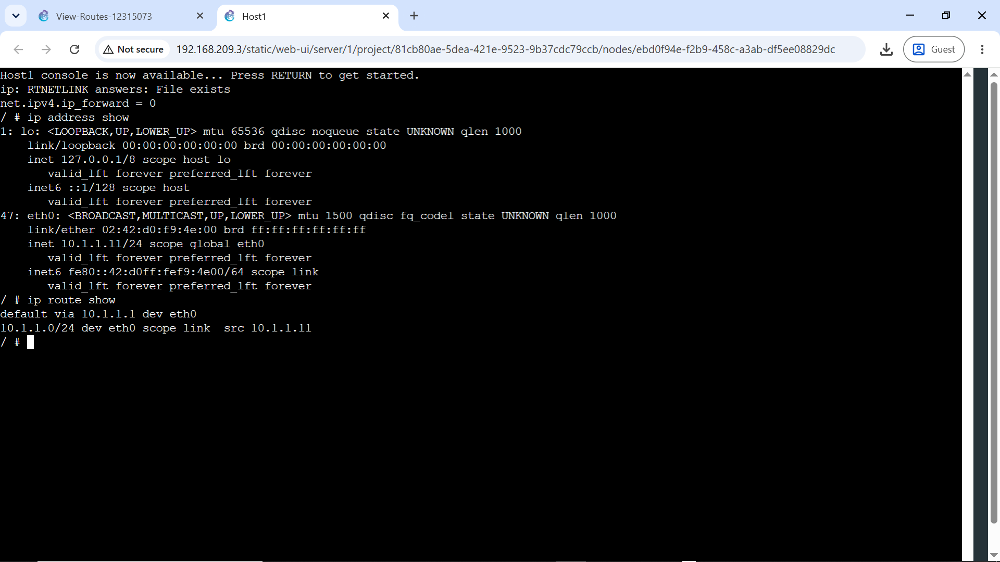
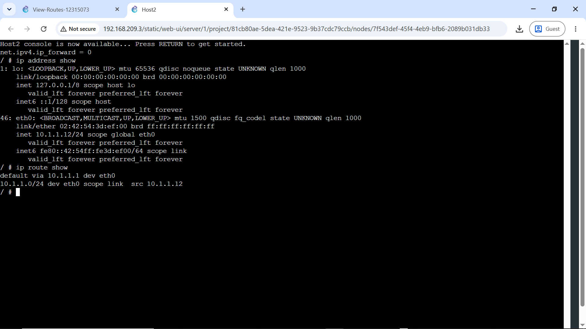

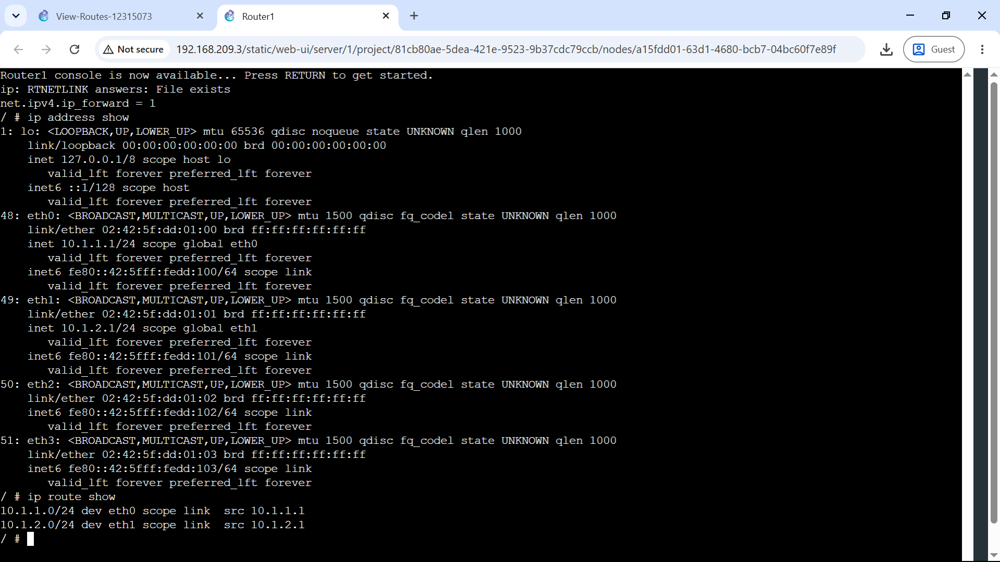

A cross-subnet ping from Host1 to Host3 returned **5/5 replies and 0% packet loss**.

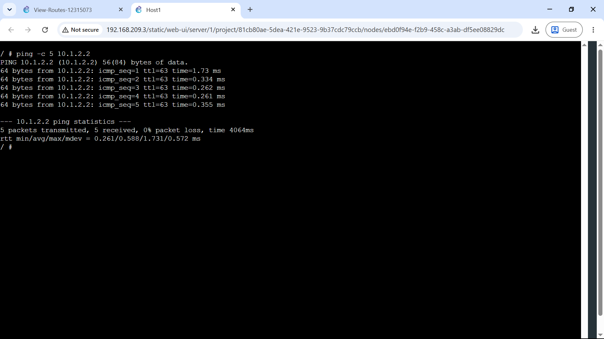

[Task 1 project](View-Routes-12315073.gns3project)

## Task 2 – OSPF Dynamic Routing
The supplied OSPF topology contained four FRR routers and two alternative paths between Host1 and Host2.

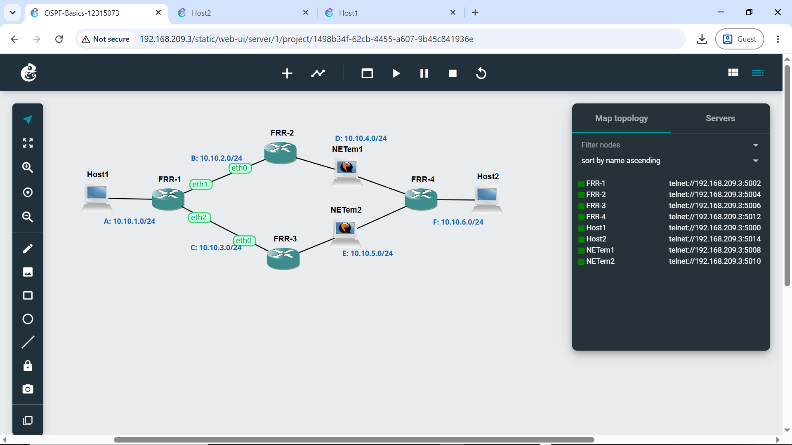

FRR1 formed full OSPF adjacencies with neighbours `10.10.4.2` and `10.10.5.3`.

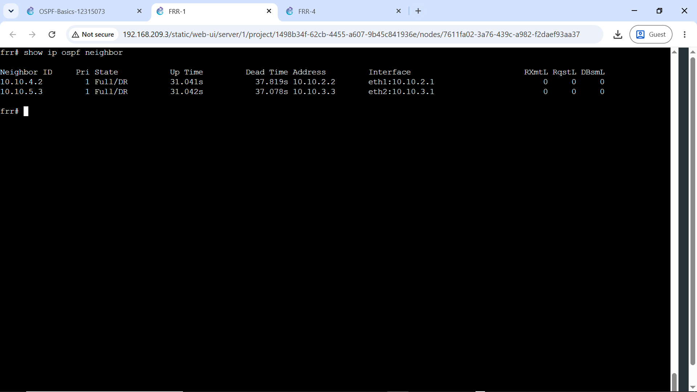

Routing information was inspected using:

```text
show ip ospf neighbor
show ip ospf route
show ip route
```

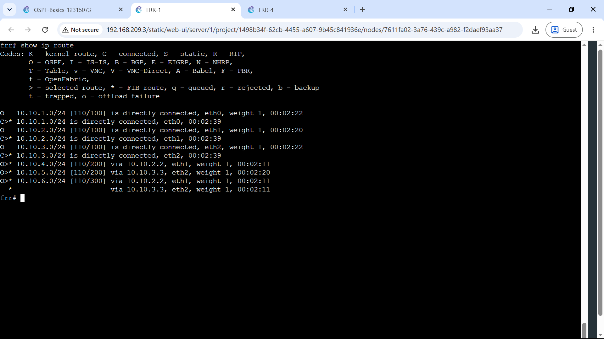
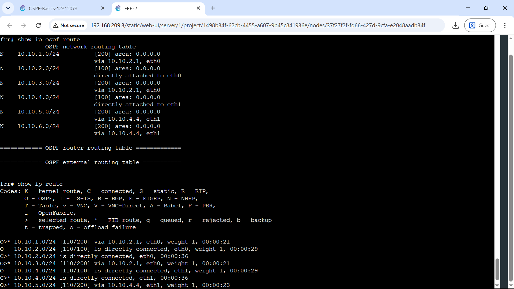
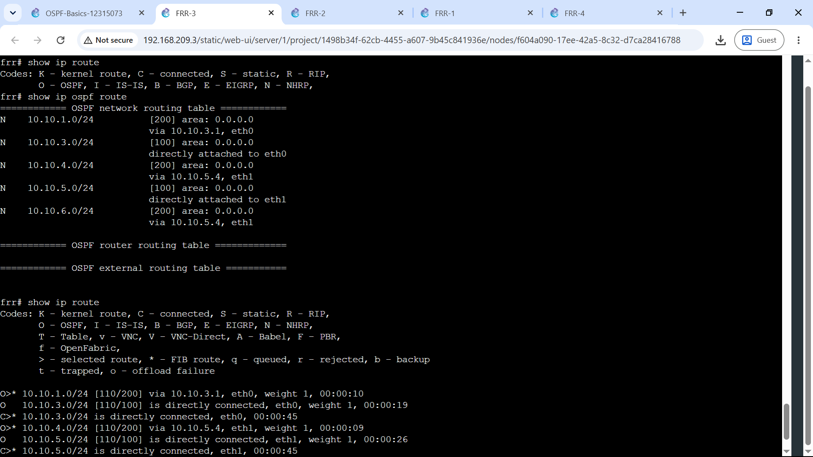
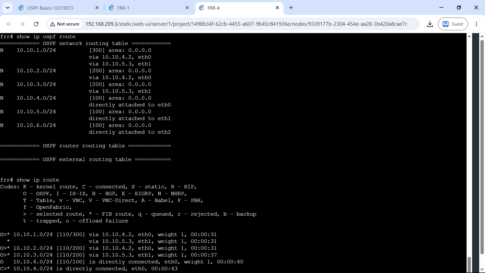

### Routing Summary

| Router | Destination | Next Node |
|---|---|---|
| FRR1 | `10.10.4.0/24` | FRR2 (`10.10.2.2`) |
| FRR1 | `10.10.5.0/24` | FRR3 (`10.10.3.3`) |
| FRR1 | `10.10.6.0/24` | FRR2 or FRR3 |
| FRR2 | `10.10.1.0/24` | FRR1 (`10.10.2.1`) |
| FRR2 | `10.10.5.0/24` | FRR4 (`10.10.4.4`) |
| FRR2 | `10.10.6.0/24` | FRR4 (`10.10.4.4`) |
| FRR3 | `10.10.1.0/24` | FRR1 (`10.10.3.1`) |
| FRR3 | `10.10.4.0/24` | FRR4 (`10.10.5.4`) |
| FRR3 | `10.10.6.0/24` | FRR4 (`10.10.5.4`) |
| FRR4 | `10.10.1.0/24` | FRR2 or FRR3 |
| FRR4 | `10.10.2.0/24` | FRR2 (`10.10.4.2`) |
| FRR4 | `10.10.3.0/24` | FRR3 (`10.10.5.3`) |

Before the failure, traceroute used the upper path through FRR2. After stopping **NETem1**, OSPF reconverged and traceroute changed to the lower path through FRR3.

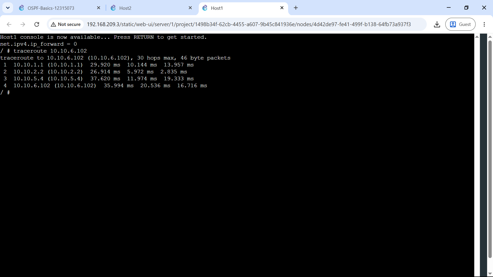

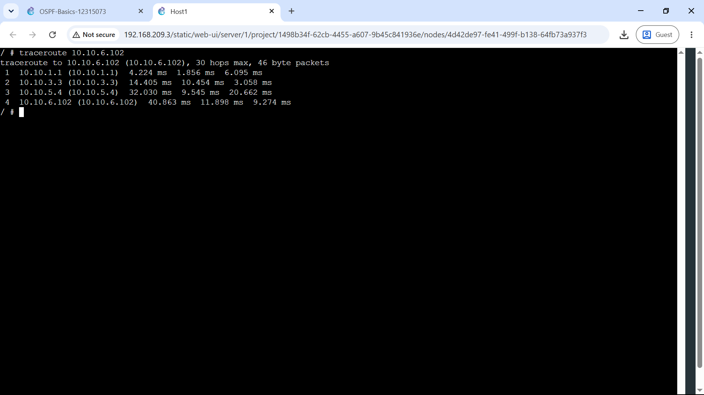

[Task 2 project](OSPF-Basics-12315073.gns3project)

## Key Learning and Reflection
Task 1 showed how a default gateway sends traffic to a router when the destination is outside the local subnet. Task 2 showed the main advantage of dynamic routing: OSPF automatically recalculated the path after a link failure. This provides resilience that would require manual route changes in a purely static design.
