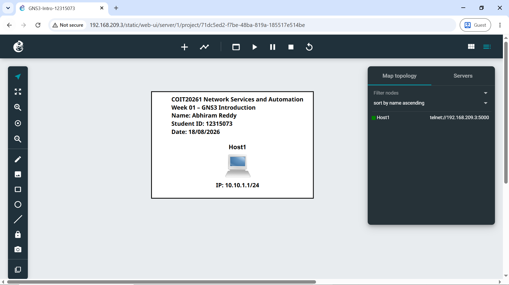
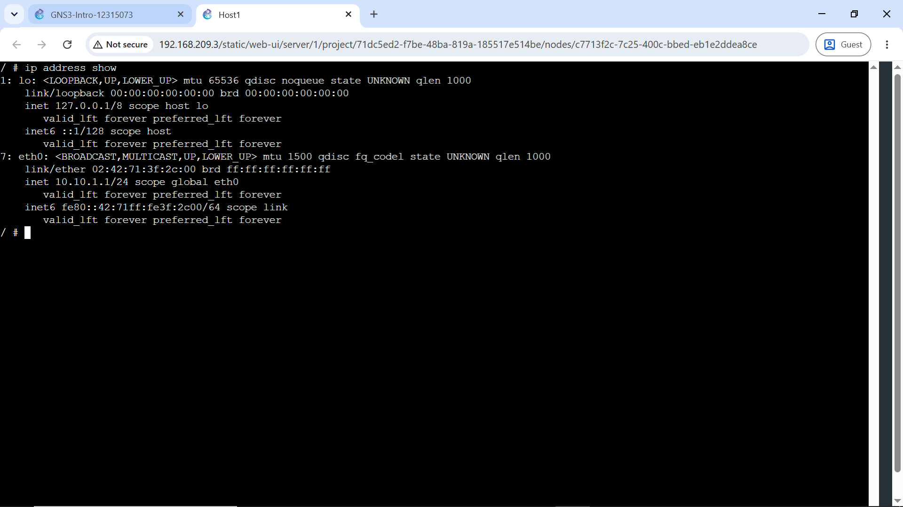

# Week 01 | Introduction to Internetworking
**Student ID:** 12315073

## Work Completed
I created the GNS3 project `GNS3-Intro-12315073`, added one Linux host and configured `eth0` with the static address `10.10.1.1/24` using `/etc/network/interfaces`.

## Testing and Evidence
The address was verified with:

```bash
ip address show
```

The output confirmed `10.10.1.1/24` on `eth0`.





[Project file](GNS3-Intro-12315073.gns3project)

## Key Learning and Reflection
This activity established the basic GNS3 workflow of creating, configuring, starting and testing a node. I also learned that a default gateway is unnecessary when a host is not communicating outside its local network. Verifying the running configuration is important because editing a configuration file alone does not prove that the expected address is active.
